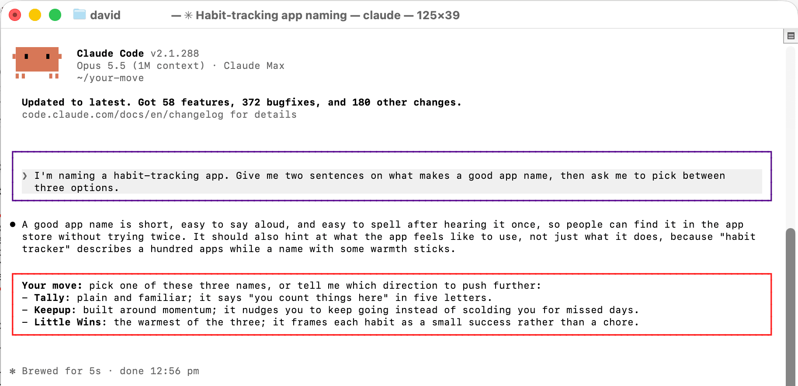

# Your Move

**Find your messages. Never miss what Claude is waiting on you for.**



A Claude Code plugin for long sessions. When you scroll back, everything Claude says looks the same, and the one line where it asked you to decide something is easy to miss. Your Move fixes two things:

- **Your messages get a border**, so you can find what you said at a glance.
- **Anything Claude needs from you gets an outline.** The plugin asks Claude to open any decision, question or action for you with a **Your move:** line, and draws an outline around that section so it stands out from the reasoning around it.

Nothing else in the transcript changes. Background-task notices and messages from other agents keep their normal look, so the border only ever means "you said this", and the outline only ever means "this is on you".

## Install

From your shell:

```bash
claude plugin marketplace add davidtheproduct/your-move
claude plugin install your-move@davidtheproduct
```

Or from inside a Claude Code session:

```
/plugin install your-move --marketplace davidtheproduct/your-move
```

New sessions pick it up. It needs a recent Claude Code, since it is built with Claude Code's mods API (function hooks), which is in early access.

## Choose your colours

Open `/config` and look for the two Your Move rows:

| Setting | What it colours | Default |
| --- | --- | --- |
| Your messages: border colour | The border around messages you type | `#5b0a91` (deep violet) |
| Your move: outline colour | The outline around what needs you | `#ff2020` (red) |

Use a hex colour such as `#00aa88`. Anything else falls back to the default.

## How it works

- **The border** wraps the transcript row Claude Code draws for each message you send, from the terminal or the Remote Control bridge.
- **The outline** starts at a line beginning `Your move` (bold or not, and with or without a `>` quote marker) and covers that paragraph plus any list or quoted lines directly under it. A blank line followed by ordinary text ends it, as does the first unquoted line after a quoted block. The lead is always drawn in bold, and quote markers are dropped since the outline replaces them.
- **The instruction**: the plugin adds a short paragraph to Claude's system prompt asking it to put what needs you in a quote block led by **Your move:**, at most once per reply and only when something really needs you. It isn't added in headless runs (`claude -p`), which draw no transcript.

Only the drawing changes. Your stored conversation, and what Claude reads back from it, are untouched.

## Use it in claude.ai and Cowork

The same plugin installs in claude.ai chat and Cowork, where it loads the bundled `your-move` skill. Claude then sets apart anything it needs from you as a quote block led by **Your move:**, which claude.ai draws with a bar down its left edge. The coloured border and outline are Claude Code only.

1. In claude.ai or the desktop app, open **Customize > Plugins**.
2. Add a marketplace from GitHub: `davidtheproduct/your-move`.
3. Install **Your Move**.

Chat applies a skill when its description fits the reply, so the quote appears most of the time rather than every time. In Claude Code the mod adds the instruction to every session.

A plugin installed on your claude.ai account also appears in Claude Code at the next session start. If you've installed it there, you don't need the command-line install as well.

## Using Codex, Cursor, Gemini CLI or Copilot?

The border and outline need Claude Code: no other agent tool lets a plugin redraw its transcript (as of October 2026). The habit underneath them travels, though. Paste this into your project's `AGENTS.md`, the shared instructions file that Codex, Cursor, Gemini CLI, GitHub Copilot, opencode and others read, and the agent will flag what needs you with a bold **Your move:** line:

```markdown
## Flagging what needs me

When part of a reply needs me to act, decide, or answer something you are waiting on,
put it in its own section whose first line starts with `**Your move:**`, with any options
as a list directly beneath it. Use at most one such section per reply, near the end, and
only when something truly needs me. Keep findings, reasoning and narration outside it.
```

## Develop

```bash
claude --plugin-dir .          # run Claude Code with your working copy
claude plugin test .           # run the tests
claude plugin validate --strict .claude-plugin/plugin.json
```

## Licence

MIT, by [davidtheproduct](https://github.com/davidtheproduct).
